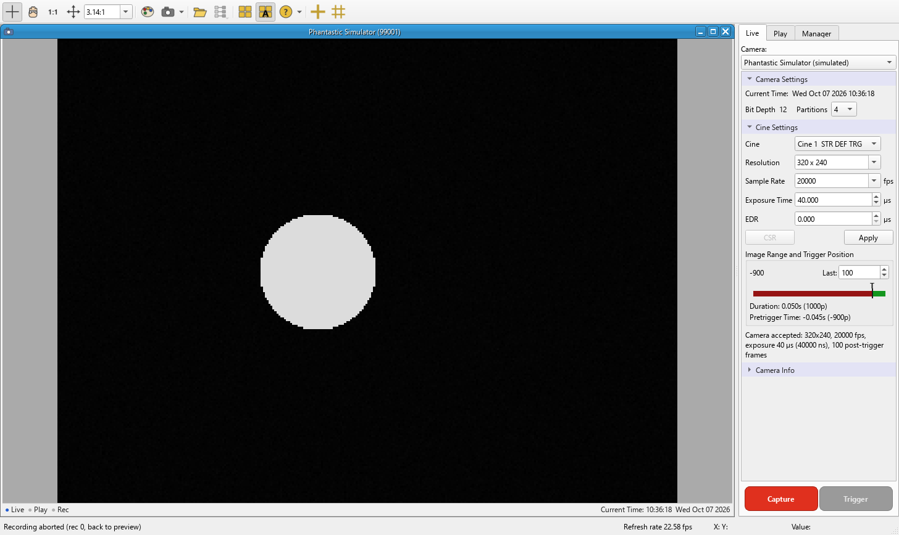

# Phantastic

Open-source control and data software for Vision Research **Phantom** high-speed cameras.
It does what you need PCC for in a lab (find the camera, set resolution, frame rate and
exposure, record, trigger, download), and it keeps your data raw: no hidden LUT, gain, gamma,
tone curve, filter or frame selection.

> Phantastic is an independent project. It is not affiliated with, endorsed by or supported by
> Vision Research or AMETEK. "Phantom" is their trademark.

**Status: 0.1, early.** Tested on one camera so far, a Phantom v2512 (firmware 23070): discover,
live view, record, trigger, download and the built-in camera test all work, and the files it
saves open in PCC. The file tools are also checked against real recordings and PCC's own output.
Other models speak the same protocol but are untested; please report what you find.

Platforms: developed on Windows. Pure Python (PySide6, numpy, tifffile, psutil), with no
Windows-only code, so macOS and Linux should work, but they are untested.

## What it does

| | Phantastic | PCC |
|---|---|---|
| Download | the pixels the camera sends, in the format you choose (P16, P16R uncorrected, P10, 8); by default as 12-bit in PCC's file layout, or as full 16-bit P16 | applies the stored display settings on export |
| "Unprocessed" read | raw values | black/white stretch, values below black clipped to 0 |
| Decimation | explicit rule (multiples of N from the trigger, or from the first frame), lossless, true time stamps kept | multiples of N from the trigger; frame rate in the file not updated |
| TIFF export | 16-bit raw values, per-frame numbers and times in the metadata; or, with `--pcc-table`, exactly what PCC would write | 8-bit and 16-bit both pass through the display curve (16-bit = same curve ×16); "no processing" does not apply |
| Connect | reads the camera | also resets the camera clock and time zone to the PC's |
| Record | records into the cine you choose | the SDK's record call deletes every partition first |

Details and how each was measured: [docs/PCC_BEHAVIOUR.md](docs/PCC_BEHAVIOUR.md).
To record what PCC does with your own camera: [docs/CAPTURE_PCC_SESSION.md](docs/CAPTURE_PCC_SESSION.md).

## Install

```
pip install .            # command line + library (numpy, tifffile)
pip install .[gui]       # + desktop app (PySide6)
```

## Use

Desktop app: `phantastic-gui` (or `python -m phantastic.gui`). It is laid out like PCC 3.11: tool strip on top,
image panels in the middle, Live | Play | Manager tabs on the right. Click **+S** in the Manager tab (Add
Simulated Camera) to try it without a camera. In the Play tab a cine still in camera memory can be reviewed,
marked with `[` / `]` and saved; Image Tools (Ctrl+I) changes the display only, never the recorded values.
First time with a camera: [docs/TEST_TODAY.md](docs/TEST_TODAY.md).



Command line:

```
phantastic discover
phantastic info --ip 100.100.1.1
phantastic set --ip 100.100.1.1 --res 1024x512 --rate 50000 --exposure-ns 10000 --post-trigger 1000
phantastic record --ip 100.100.1.1 --cine 1
phantastic trigger --ip 100.100.1.1
phantastic download --ip 100.100.1.1 --cine 1 --out shot.cine --format P16
phantastic download --ip 100.100.1.1 --cine 1 --out shot_x100.cine --step 100
phantastic download --ip 100.100.1.1 --cine 1 --out burst.cine --first -200 --count 500   # 500 frames from image -200
phantastic decimate shot.cine shot_x10.cine --step 10
phantastic tiff shot.cine shot.tif --first -500 --last 500
phantastic tiff shot.cine shot_pcc.tif --pcc-table auto      # bit-identical to PCC's 8-bit export
phantastic simulate --profile miro-m310
```

Python:

```python
from phantastic.cine import CineReader
r = CineReader('shot.cine')
img = r.read(0)              # numpy array, raw sensor values, top-down rows
t = r.relative_times()       # seconds from the trigger, from the per-image time stamps
n = r.image_numbers          # camera image numbers (trigger = 0)
```

## Things to know

* **P16 is full scale.** A 12-bit value v arrives as 16·v. PCC shows a 16-bit file almost white,
  so Save Cine stores value >> 4 as 12-bit in PCC's layout by default (`download --as-12bit` on
  the command line). For P16R this is lossless. On a v2512, P16's low 4 bits carry the fraction
  left by the camera's own pixel correction; the 12-bit file drops it and the save summary says
  how many pixels had one. Untick the option (or omit `--as-12bit`) to keep full 16-bit P16, which
  ImageJ/Fiji and Phantastic read but PCC displays white.
* **P16/8 are corrected by the camera** (fixed-pattern noise and pixel response). P16R/8R are not.
* **Decimated cines are renumbered.** A cine numbers its images consecutively, so image k of a
  file decimated by N is camera image k·N (+ offset, written in the file description). Times come
  from the per-image time stamps, which are copied unchanged.
* **10-bit packed (P10) is companded.** It is linearised to 12 bit with the table from the Cine
  File Format specification.

## How it was built

From public sources only: Vision Research's *Cine File Format* specification and *PH16 camera
protocol* (v2.3), real camera transcripts published by Diamond Light Source (Apache-2.0), and
black-box observation (comparing files, and logging the commands the vendor software sends to
Phantastic's simulated camera). No vendor code was decompiled or copied. The vendor's software
is used only as a test oracle (`tools/vendor_*.py`) and is never needed to run Phantastic.

## Tests

```
pytest -q tests
```

Real-file tests run when the lab data drive is present; vendor-oracle checks need PCC installed
and run under the Python version its `PhPy` module was built for.

## License

MIT. `phantastic/data/miro_m310_tree.txt` is derived from DiamondLightSource/miroCamera
(Apache-2.0; see `NOTICE`). The 10-bit table is from Vision Research's Cine File Format specification, which
permits copying it.
